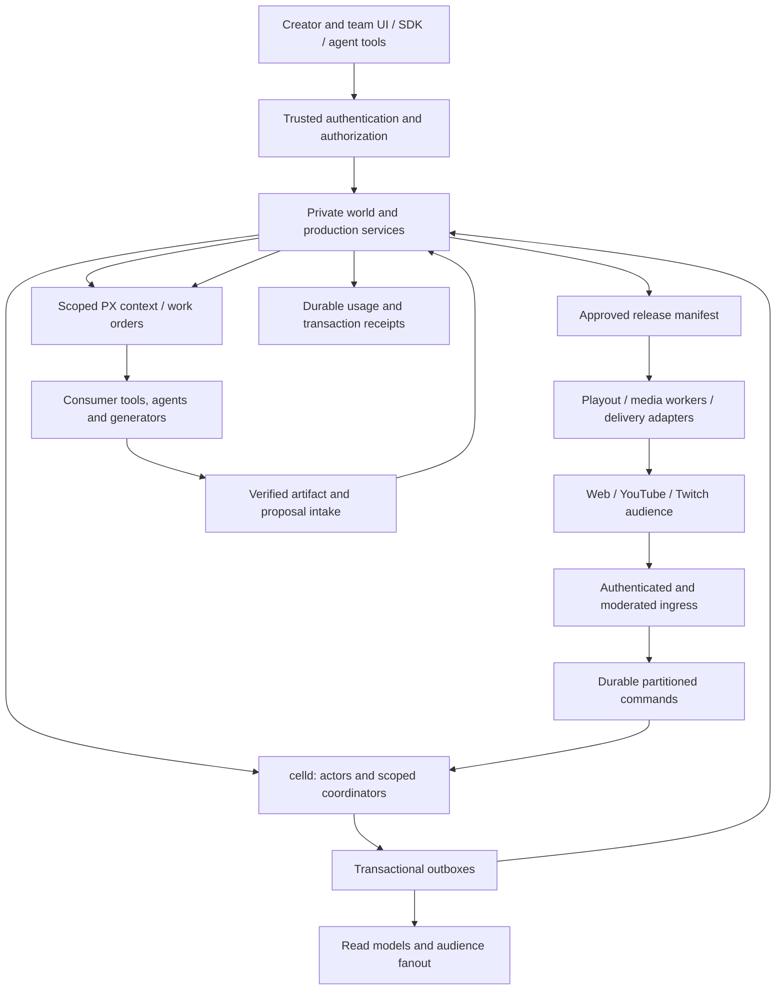

# Portals Living IP

## Comprehensive product, business, functions, and integration plan

**Planning baseline: 2026-09-07. Status: complete proposed product plan; implementation and production qualification remain gated work.**

Portals turns an idea or existing authorized IP into a persistent world that a creator can operate, adapt, publish, and grow across media. PX gives the world addressable identity and committed history. celld gives its characters durable lives. Portals capabilities connect that common state to production tools, channels, audiences, and commercial operations. PX is the interchange surface through which consumers take a precisely selected world into their own tools.

**The generation layer is consumer-provided.** Portals does not supply models, model hosting, inference workers, creative generation algorithms, generated voice services, or a first-party image/video/3D generation pipeline in this plan. Consumers can use generative tools, traditional production, game engines, human teams, or combinations. Portals supplies the state, context, permissions, work contracts, asset intake, validation gates, release records, and delivery infrastructure around them.

The full earlier celld + PX specification is included in Appendix A. Its snapshot, branching, messaging, schema, LOD, and failure details remain part of this plan. Where it mentions generation workers, model dispatchers, or generation budgets, these refer to **consumer-owned implementations connected through the contracts in this plan**. The platform's role is bounded work admission and result acceptance. This explicit boundary supersedes any implication of a platform-owned generation layer.

### Document navigation

- Product and business: sections 1–6, 20–22.
- Functions and user workflows: sections 4–10, 15–19.
- Architecture, packages, and integrations: sections 7–14.
- Reliability, operating economics, delivery, and acceptance: sections 19–25.
- Full inherited technical specification: Appendix A.

## 1. Product thesis and measurable value

The unit creators own is a **world/IP project**, containing reusable characters, relationships, locations, props, rules, storylines, history, and representations. A film, episode, game, VR session, or livestream is a selected experience of that world. Published media remains traceable to the state, assets, permissions, and decisions that produced it.

The product promise is: **build a world once, keep control of its identity, and operate multiple experiences from its evolving history.** This reduces repeated briefing, asset recreation, continuity repair, and tool-specific state reconstruction. Consumer tools still determine creative quality, generation cost, and medium-specific execution.

The business case depends on four measurable effects:

| Value driver | Customer outcome | Evidence required |
| --- | --- | --- |
| Reuse of IP and production inputs | Less repeated preparation across episodes and tools. | Reused entity/asset references, fewer manual rebriefing hours, faster subsequent releases. |
| Continuity and control | Fewer rejected outputs and expensive corrections. | Rework hours and accepted-output rate against a pre-platform baseline at comparable quality. |
| Reliable recurring operations | More completed programming with less operator effort. | Release cadence, operator hours per episode, playout availability, recovery time. |
| Persistent audience relationships | Reasons to return, participate, and support a world. | Returning audience, repeat participation, subscriptions or sponsorship attributable to the experience. |

More generated files alone are not a success metric. The scarce product outcome is recognizable IP that people return to, with a sustainable production and distribution cost. Platform adoption does not guarantee memorable characters, audience growth, brand approval, or profitability; pilots must establish those effects.

The defensible position is the combination of a trusted history, working integrations, production evidence, creator workflows, reusable licensed assets, and audience continuity. A generic entity schema by itself is not a defensible business. Portability should increase confidence and adoption rather than be undermined to create switching costs.

## 2. Initial customer, market sequence, and scope

The first commercial customer is a creator or small production team with recognizable recurring characters, an owned audience channel, permission to use the source IP, and a recurring publishing problem. The initial experience is an episodic story channel with selected live audience decisions and persistent character memory.

This customer is useful because the same project exercises continuity, production handoff, recurring releases, live programming, and return engagement without first requiring a complete game engine or VR application.

| Segment | Job to be done | Initial commercial unit | Expansion condition |
| --- | --- | --- | --- |
| Creator-led entertainment | Produce a recognizable recurring series and involve fans. | Paid world/channel workspace plus measured runtime and delivery usage. | Demonstrate repeat publication and willingness to pay. |
| Studios and IP owners | Coordinate larger teams and reuse authorized IP across productions. | Team/enterprise workspace, integration and support agreement. | Approval, provenance, permission, and export controls proven. |
| Brands and agencies | Operate consistent branded worlds and approved placements. | Campaign or managed-world contract; production remains consumer-provided. | Placement evidence and review workflow proven. |
| Gaming and immersive developers | Import IP, run persistent characters, and report consequential events. | Developer runtime usage and supported adapters. | Narrative state versus game simulation authority is explicit. |
| Education | Reuse curriculum worlds with controlled branching and learner-specific progress. | Institution/site or class-based subscription with usage limits. | Educator review, privacy, accessibility, and assessment controls proven. |
| Tourism and hospitality | Operate location-specific characters, stories, and guest experiences. | Per-site/world agreement with integration/support. | Operator control, localization, offline behavior, and verified factual content proven. |

This is a proposed commercial prioritization. The older Cloud ADR describes four channel types being developed in parallel without prioritization. This plan retains shared capability architecture while sequencing customer validation and production rollout. It does not fund four bespoke stacks or silently assume every medium ships at the first launch.

Films, TV series, channels, games, VR/AR, interactive stories, and live experiences remain in the full product scope. Their adapters mature separately. A shared world removes repeated identity work; it does not automatically turn a movie into a playable game or supply rigs, interaction design, physics, or spatial assets.

## 3. Product boundary: platform versus consumer

| Function | Portals owns | Consumer owns |
| --- | --- | --- |
| World creation | Structured authoring/import, identifiers, validation, versions, permissions. | Ideas and authored or generated content. |
| Story and character intelligence | State, goals, permitted actions, context selection, bounded work requests, result validation. | LLM policies, prompts, model selection, inference and autonomous reasoning code. |
| Production | Work orders, dependencies, approvals, receipts, release manifests, asset handoff. | Writing, image/video/audio/3D creation, editorial decisions, engine-specific rendering. |
| Consistency | Deterministic rule checks, pinned references, required evidence, approval gates. | Creative/semantic evaluators and human review where deterministic checks cannot decide. |
| Media operations | Artifact ingestion, packaging, deterministic composition/transcoding when configured, delivery and playout. | Generative media creation and specialized creative toolchains. |
| Distribution | Destination authorization, schedules, connector lifecycle, receipts, health and recovery. | Channel ownership, publishing authority, editorial programming. |
| Cost | Platform usage ledger and admission limits; optional display of reported external costs. | Provider bills, generation budgets, inference credentials and execution. |

The platform must work with manually supplied assets and deterministic character policies when no generator is installed. A missing consumer capability returns an explicit `consumer_required` or `capability_unavailable` status; it cannot silently call a fallback model.

Existing narrative-engine `generateBlock` convenience APIs need not be removed or broken. The new core integration uses context-building and proposal intake. A consumer may call those provider-driven APIs from its own application. Their direct insertion path must not bypass the new canon, permission, or publication gates.

## 4. Product surfaces and principal functions

| Surface | Functions | User-visible result |
| --- | --- | --- |
| World workspace | Create/import a world; edit its bible; browse entities, relationships, events and representations; compare revisions. | A navigable, reusable source of IP truth. |
| Character workspace | Author identity; inspect current memory/goals/schedule; configure permitted autonomy; see applied configuration and history. | Characters with understandable behavior and persistent lives. |
| Story workspace | Define arcs, beats, prerequisites, allowed decisions, protected facts and endings; stage proposals. | Steerable stories with explicit continuity. |
| Branch explorer | Fork a save or live cut; compare alternatives; preview consequences; promote approved changes. | Safe experimentation without corrupting the running world. |
| Production board | Plan episodes/scenes; issue work orders; connect tools; review returned artifacts; approve a release. | Reproducible multi-tool production from pinned inputs. |
| Channel console | Schedule programming; stage assets; preview; go live; moderate; monitor destinations; stop safely. | An operated channel, not merely a folder of content. |
| Audience experience | Watch/read/play, chat, vote, follow characters, receive recaps, participate within a declared scope. | Participation that can visibly affect future events. |
| Team and integrations | Assign roles, grant agent scopes, manage capabilities, approve changes, rotate/revoke integrations. | Scalable collaboration without sharing administrator credentials. |
| Business console | Usage/costs, release performance, subscriptions, sponsor placements, payout statements when enabled. | Operational and commercial accountability. |

Implement these as views of shared APIs. Avoid a second data model in the frontend. Production functions should be callable through SDK/API and agent plugins, with equivalent permission and audit semantics to the UI.

## 5. Core workflows

### 5.1 Idea to first recurring channel

1. Create a world from a template or import authorized source material. Record owner, contributors, permitted uses, and default visibility.
2. Create characters, locations, relationships, props, plot arcs, world rules and a visual/voice reference collection. The creator may use any external creation tool.
3. Approve a baseline canon revision and initialize the required runtime actors from pinned configuration.
4. Plan a short episode or interactive chapter with known starting state, protected facts, expected beats, and production tasks.
5. Export a scoped context/asset bundle through the PX integration. Consumers write, generate, edit, animate, or render against those inputs.
6. Ingest returned artifacts and proposed story changes. Validate hashes, provenance, permissions and structural constraints; collect required creative review.
7. Publish a release manifest tying approved media to its source world cut, story decisions, ratings and usage permissions.
8. Stage programming, authorize destinations, run a rehearsal, and publish or broadcast under the creator's approval policy.
9. Admit audience input through moderation and decision windows. Accepted consequences update actor state and future programming; finished episodes remain reproducible.
10. Save the resulting world, show what changed, and prepare the next episode using its retained history.

### 5.2 Film and TV production

An episode or film has a production branch and an immutable release. Writers, artists, editors and external agents work on bounded scene tasks. Each task pins character and prop references, story state, dependency outputs, technical requirements and approval policy. Changing a dependency invalidates affected downstream approvals; unrelated completed work remains reusable.

For a series, maintain season/episode arcs, continuity reports, recurring assets, approved recaps, and release order. Production can explore episodes in parallel, but canon-affecting outcomes require an explicit ordering/merge decision. The system cannot safely assume two independently produced episodes can both advance the same character history.

### 5.3 Live, massively social story

The broadcaster starts a scheduled session with a visible participation policy: viewers may suggest, vote, control specified actions, or open personal alternatives. Chat is first conversation, then optionally a proposal. A selected decision becomes a durable command only after the decision authority closes the window and checks policy.

Autonomous characters react under their configured LOD and budget. External reasoning or media work returns asynchronously. Playout uses approved ready assets or a defined fallback until new work is ready. A live badge identifies what is actually live—audience interaction, simulation, or outgoing broadcast—and does not imply every frame is newly generated.

### 5.4 Existing IP to game, VR or AR

Select a source cut and export permitted entity identities, relationships, representations, schemas and interaction contracts. A consumer game/immersive engine maps them into scenes, rigs and mechanics. Its authoritative game server owns real-time movement/physics; it submits authenticated consequential events such as completing a quest or moving an owned prop. Portals owns the resulting persistent narrative state according to the agreed authority map.

A player's private run, a multiplayer world, and the creator's canonical IP are separate scopes. Playing a licensed adaptation never grants authority to overwrite the source canon. AR/VR clients use local rendering and prediction; rendering frames and tracking packets do not go through Lore or an actor's event log.

### 5.5 A concrete continuity example

On world day 47, Alice owns the tavern, Bob distrusts her because of a recorded event, and the festival is due tomorrow. A film task, text chapter and game adapter receive the same pinned facts. An audience vote chooses a festival venue. The decision changes the running branch, records why it changed, and affects tomorrow's context. A sponsor's approved lantern may appear at the venue under a scoped placement agreement. None of these operations silently changes Alice's ownership, removes Bob's memory, or rewrites yesterday's released film.

## 6. Engagement, status, and creator control

| Motivation | Product mechanism | Measurement and constraint |
| --- | --- | --- |
| Creation and expression | World templates, imports, remix permissions, connected tools. | Time to first coherent world and accepted release; preserve creator attribution. |
| Agency | Explicit decisions, personal branches, acknowledged consequences. | Fraction of accepted inputs with visible outcomes; never imply every chat message controls canon. |
| Connection | Shared sessions, chat, factions, collaborative events. | Repeat participation and healthy community activity; moderation and block tools. |
| Discovery | Scheduled events, character goals, reviewed recaps, world-change feeds. | Return visits and episode completion; avoid purposeless activity loops. |
| Belonging | Character follows, world membership, faction identity, reusable audience profile. | Repeat engagement across episodes; user-controlled identity and visibility. |
| Status | Founder/contributor credits, event attendance, recognized decisions, creator acknowledgments. | Legitimate participation and creator satisfaction; transparent earning rules. |

Status should arise from contribution and shared experiences. A paid entitlement can unlock clearly described participation or cosmetics, but payment must not silently override canon, moderation, competitive fairness, or classroom outcomes. Public activity signals require actual evidence; do not fabricate live viewers or pretend an autonomous character is a human broadcaster.

Creators set autonomy scope, allowed decision types, private/public memory boundaries, review requirements, quiet periods, and cost ceilings. An operator can pause autonomy, close audience decisions, revoke a plugin, freeze canon promotion, or stop one distribution destination without destroying the world.

## 7. Domain model, identity, and authority

| Aggregate | Stable identity and key state | Authority |
| --- | --- | --- |
| Organization/project/world | Tenant, repository, world ID, membership and ownership. | Trusted identity/authorization services; PX for authored world content. |
| Entity | Immutable entity ID; manifest, references, representations. | PX committed history. |
| Timeline/run | Lore branch UUID; optional runtime incarnation for in-place resets. | World lifecycle service; Lore branch ancestry. |
| Actor | Repository + branch/run + entity ID; local state sequence. | Its celld SQLite database. |
| Story arc/beat | Conditions, allowed transitions, protected facts, resolution state. | Authored specification in PX; live transition authority in a designated story actor. |
| Decision window | Session/beat, eligible choices, admission cutoff, voting policy, final result. | Durable decision coordinator; sharded intake where necessary. |
| Production run/work order | Pinned inputs, dependencies, consumer binding, status, deadlines, receipts. | Production coordinator's durable database. |
| Artifact/release | Content digest, metadata, source cut, approval evidence, rights/ratings. | Immutable PX/object artifacts plus controlled release records. |
| Channel/session/program slot | Experience configuration, schedule, playout cursor, destinations. | Channel coordinator; distribution receipts are operational evidence. |
| Audience profile | Subject identity, consent, memberships, private progress. | Audience service; only consented world consequences enter shared history. |
| Sponsor agreement/placement | Permitted assets, context, scope, expiry, approvals and evidence. | Approved business records and release policy. |
| Usage/transaction | Unique receipt, tenant, meter, quantity, price/contract version. | Durable billing ledger and payment provider reconciliation. |

Do not overload a chapter choice ID, Lore branch ID, production branch ID, channel session ID and runtime incarnation. They serve different purposes. A choice usually advances a story within the current run. It creates a full world branch only when the product explicitly requests an independent timeline.

The default is one repository per world/project with tenancy outside the PX URI. Cross-world references must pin external revisions and permissions; a save in one repository is not an atomic snapshot of several repositories. Large franchise organization can link worlds through explicit dependency locks rather than creating one global high-contention HEAD.

## 8. Versioning, canon, release, and adaptation semantics

Four different events must remain distinguishable:

1. **Runtime mutation:** a durable local actor transition, with no Lore publication.
2. **Authored revision:** a change to manifests or rules; running actors adopt it explicitly.
3. **World save:** a retained consistent runtime cut and its descriptor set, published into Lore.
4. **Release:** approved, reproducible media/experience inputs and outputs selected for distribution.

A runtime save is not permission to broadcast. A published video is not automatically canonical. A new authored persona does not silently replace the configuration of an actor with older memory. These relationships are explicit fields and policy decisions.

Canon has scoped facts, temporal validity, provenance, authority and change policy. Useful categories are protected canon, editable authored facts, experienced runtime facts, hypotheses/unreliable character beliefs, and noncanonical proposals. A character's belief can contradict objective world truth without being a database error.

Store identity, relationship and fact references structurally. A minimal story-rule model covers prerequisites, forbidden outcomes, optional beats, allowed transitions, time constraints, and which role may resolve a conflict. Avoid inventing a general programming language or embedding arbitrary migration SQL in manifests. Consumer policies can suggest a transition; the authority validates and applies it.

Branching a retained save shares immutable objects. First activity materializes an independent actor database. True page-level COW remains an optional native storage extension. For live forks, capture changed actors and messages in flight using the full barrier protocol in Appendix A. A source branch's later state is never the bootstrap source of its earlier fork.

Automatic merges are limited to demonstrably independent authored changes. Memories, causally linked events, spent inventory and story outcomes require semantic reconciliation. The default promotion workflow previews a change set, verifies dependencies and permissions, and records a new canonical outcome; it does not union two histories indiscriminately.

An adaptation can pin a source world cut while maintaining its own run and medium-specific assets. Define whether its outcomes are local, proposed for source canon, or delegated canonical events. Persist the mapping; a game adapter cannot infer it from a shared entity name.

## 9. Consumer work and artifact contracts

The platform publishes a **work order**, not a built-in generation implementation. A consumer may complete it with humans, external agents, a DCC tool, an editor, a renderer, or a generation service.

Illustrative, proposed contract:

```ts
interface WorkOrder {
  operationId: string;
  tenantId: string;
  worldId: string;
  branchId: string;
  runId: string;
  inputBundleHash: string;
  dependencyOutputHashes: readonly string[];
  taskType: string;
  outputContractVersion: string;
  constraintsHash: string;
  consumerBindingId: string;
  deadline: string;
  attempt: number;
}

interface WorkResult {
  operationId: string;
  inputBundleHash: string;
  resultDigest: string;
  artifacts: readonly ArtifactReceipt[];
  proposedMutations: readonly WorldMutationProposal[];
  evidenceRefs: readonly string[];
}
```

These are design sketches; actual schemas define branded IDs, discriminated result states, bounded collections and versioned validation. Credentials, stream keys and expiring download URLs never become part of a committed content descriptor.

The lifecycle is `planned → ready → dispatched → result_received → validated → approved/rejected → released`, with cancellation, timeout, supersession and retry represented explicitly. Retries preserve logical operation identity; changing inputs creates a new operation or declared revision. Reusing an operation ID with different content is a conflict.

Results arrive through authenticated intake or a queue. Validate producer authorization, tenant/run scope, input/dependency versions, content hashes, required evidence, and mutation preconditions. A late result can be retained as an unaccepted artifact without changing the current world. Partial artifacts cannot cause a release to air before the release's required set is complete.

Consumers retain inference credentials and choose providers. Portals may enforce agreed job count, duration, output-size and concurrency ceilings; it cannot guarantee a consumer's external bill. Cost estimates and reported provider receipts are labeled estimates/reports and never treated as platform charges without an explicit contract.

The existing narrative engine already separates `NarrativeDataProvider`, `PxProvider` and `GenerationProvider`; `buildContext` supports retrieval-only use. Extend its adapter with exact tenant/branch/cut scope. Its currently channel-oriented queries and cache keys must not let two branches sharing a channel identifier reuse each other's context. A context bundle records selected sources and omissions; context retrieval is not guaranteed complete semantic recall.

## 10. PX and multi-tool portability

Within the allowed repositories, the verified PX seam is `PxProvider.enrichContext`, which returns entities, representations, references, relationships and event history. A complete standalone PX export implementation or executable was not established by this inspection. The plan therefore specifies the export contract and an adapter; it does not invent existing `px` commands or equate PX with a particular file format.

The export product should support two distinct packages:

| Export | Contents and intended consumer |
| --- | --- |
| Context/production bundle | Selected facts, references, story constraints, source cut, representations, rights and attribution metadata. For creative tools and production teams. |
| Runtime/adaptation bundle | Versioned application schema, retained actor cuts where permitted, initialization policy, event contracts, world clock and asset bindings. For compatible runtime/game/immersive adapters. |

An export lock records immutable source revisions, entity IDs, asset hashes, schema/adapter versions, dependency edges, usage scope and bundle digest. A manifest describes the referenced objects; large media stays in object storage and can be streamed or packaged on demand. Access tokens are supplied separately at delivery time. Partial exports state their omissions and unresolved dependencies.

The smallest implementation adds export/import modules to the existing SDK and a PX adapter seam. Extract `@portalshq/px-bridge` only when two real consumers or an independent compatibility lifecycle justify it. Consumers provide medium-specific transformations; Portals verifies the mapping and returned provenance.

Required round trip: export Alice at cut C42, use her in two different external tools, import outputs with their source references, and prove neither tool silently rewrote Alice's identity or the other tool's artifact. Re-importing an identical bundle is idempotent. Imported proposals cannot self-approve or acquire additional rights.

User experience: select entities/story scope and a destination adapter; preview included assets and permission constraints; export; reconnect resulting artifacts to the production run. Unsupported representations fail with actionable compatibility errors. “Export to game” never claims to supply a complete game from narrative metadata alone.

## 11. System architecture and deployment responsibilities



Actor writes remain local to actor SQLite. Administrative coordinators also use their own durable state and communicate by messages. A world coordinator handles lifecycle barriers and save publication; it does not process every actor mutation or spectator packet. A production coordinator owns one run's jobs/approvals. A channel coordinator owns programming state. Separate these consistency domains when they have different ordering or load requirements.

Use one qualified durable command transport for the initial runtime integration; celld Queues can satisfy the initial adapter if their tested semantics meet the requirements. Retain application inbox/outbox records beyond broker delivery and qualify expiry/backpressure. Existing Cloud message infrastructure can be selected through an adapter where deployed and qualified. Do not require celld Queues, SQS, NATS and Kafka simultaneously merely because the repositories mention them.

Audience fanout and broadcast media queues are different systems from actor command delivery. Fanout may lose a transient packet if clients can reconnect from a durable cursor. An accepted world command cannot disappear. The Queue Broadcast capability sequences media for playout; it is not a replacement for actor inboxes or durable voting state.

Keep FFmpeg, media processing and third-party connector processes outside actor isolates. Keep arbitrary third-party agent code outside trusted celld fleets initially. Consumers run plugins in their own infrastructure and use scoped capabilities. Hosting untrusted plugin code later requires an independently qualified isolation product.

Deploy the first paid environment in one region with redundancy and recovery appropriate to the agreed service level. Add regional runtime placement when latency, residency or customer requirements justify it. Do not promise active-active ownership of a single SQLite actor across regions. The runtime's single-writer/fencing contract remains authoritative.

## 12. Existing components: evidence, reuse, and gaps

Source inspection used PX `8c5ef3646423dc6e5bd77aebfc849985e6105388` and Cloud `a2d638a3ebd39731112613cf301df3784a347e78`, including the working-tree documentation visible during review. Presence of code is not proof of deployment, load qualification or production readiness.

| Component in allowed scope | Verified useful foundation | Required integration or hardening |
| --- | --- | --- |
| `./crates/px-core` | Entity/repository APIs, Lore backend, resolution, content-addressed storage. | Exact-cut runtime descriptors, retained runtime objects, operation deduplication and atomic expected-tip publication. |
| `./typescript/narrativeengine` | Context assembly, data/PX/generation provider separation. | Cut-scoped retrieval/caching; use context-only path in core; proposal gate before canonical insertion. |
| `../cloud/packages/contracts` | Capability contracts, channel manifests, tenant and rating types. | Unify overlapping registry/manifest abstractions; add versioned world, work, release and event contracts. |
| `../cloud/packages/registry` | Capability registration and explicit resolution errors. | Registry is process-local; “latest” uses insertion order in one implementation. Pin versions/digests and resolve once per run. |
| `../cloud/packages/resolver` | Defined PX adapter interface. | Methods currently throw placeholders. Wire actual PX client with exact selectors and authorization. |
| `../cloud/packages/narrative-engine-adapter` | Proposed state/advance interface. | Methods currently throw placeholders; distinguish story-choice branches from Lore branches and add context-bound reads. |
| `../cloud/packages/runtime-core` | Presence-triggered activation and channel timers. | Timers/presence are process-local. Durable schedules, ownership and recovery must live in runtime/coordinators. |
| `../cloud/packages/realtime-fanout` | Chat, lobby, bus seam, external-chat normalization. | In-memory bus is nondurable; polls lack durable deduplication/final tally. Add durable admission/decisions and distributed fanout where needed. |
| `../cloud/packages/queue-broadcast` | Authenticated client, staged slots, receipts, hash verification contract, RTMP frame helper. | Client targets an external Queue Broadcast Server; provision a compatible media backend or a new allowed-scope service. Qualify actual server behavior, reconnect and receipts. |
| `../cloud/packages/video-delivery` | HLS playback session/health, caption support. | It does not provision an origin or schedule a channel. Integrate playout, access policy and destination lifecycle. |
| `../cloud/packages/text-image-delivery` | Chapter/text/image delivery abstraction. | Bind to immutable release IDs and authorized narrative reads, not mutable arbitrary HEAD. |
| `../cloud/packages/stubs/identity` | Audience identity/history interface. | Methods are stubs. Implement audience accounts/linking and consent using trusted auth; repository permissions are not audience identity semantics. |
| `../cloud/packages/sdk` | Manifest validation and CLI shell. | Init/deploy are TODOs. Add real operations and portable bundles; reconcile its `px` executable name with the existing PX CLI rather than shipping conflicting commands. |
| `../cloud/packages/billing-*` | OpenMeter/Lago interfaces and marketplace calculations. | Add durable metering, reconciliation, contract-based pricing/splits, refund handling and money conservation tests before real settlement. |
| `../cloud/control-plane/auth-gateway` | Auth implementation and documented trusted boundary. | Reuse qualified authentication/authorization APIs; verify deployed state through existing release gates. |
| Legacy `../cloud/control-plane` service | Reference implementations for state/outbox patterns. | Explicitly retired; must remain scaled to zero. Do not revive its HTTP handlers or legacy token path. |

The source has two capability registry models: one in `packages/contracts/src/capabilities.ts`, another in `packages/registry/src/capability-registry.ts`. Reconcile these through compatibility adapters and one target contract before adding world capabilities. This is a targeted prerequisite, not permission for a broad rewrite.

The legacy outbox relay can mark records published when transport is not configured. The billing client logs ingestion failures, and its current path is not a durable financial ledger. These behaviors must not be inherited by world-command delivery or charge collection. Reject missing transport configuration at startup; persist and reconcile required receipts.

The marketplace's current fixed lineage split is a placeholder policy, not a contract. Missing participant classes and rounding can leave amounts unallocated. Financial settlement must conserve the full amount and use approved contractual splits; a provenance ancestor is not automatically a payee.

The [Cloud production security guide](../../cloud/docs/security/lore-production-security.md) and [legacy control-plane README](../../cloud/control-plane/README.md) explicitly define containment and retirement. A new private world service uses task identities and authenticated gateway APIs. This plan does not change public ingress flags, revive a retired service, or assert that the existing foundation is already open for production.

## 13. Package and service plan

Create packages when they own a stable responsibility, contract and test boundary. A package does not imply a separate network service.

| Package | Ownership and principal functions | Dependencies / deployment |
| --- | --- | --- |
| Existing `@portalshq/contracts` | Typed world IDs, commands, cut refs, work orders, releases, decisions, usage receipts and schema compatibility. | Pure schemas/types; no infrastructure clients or generation SDKs. |
| **New `@portalshq/world-runtime`** | Actor schema, transitions, inbox/outbox, snapshot codec, migrations, LOD state and scoped coordinator classes. | celld APIs + contracts; no PX resolver or provider credentials in actor handlers. |
| **New `@portalshq/world-control`** | Provision, apply configuration, save, branch, restore, inspect, promote; exact-cut context service and lifecycle operations. | PX SDK/resolver, runtime commands, trusted authorization. Private API/worker. |
| **New `@portalshq/production-core`** | Production plans, work-order state machine, consumer adapters, artifact intake, continuity/rights gates, release manifests, programming state. | Contracts, world-control, existing delivery/broadcast and billing seams. API and worker may initially share deployment. |
| **New `@portalshq/distribution-adapters`** | YouTube/Twitch authorization and lifecycle, inbound chat adapters, outbound receipts, destination recovery. | Existing queue-broadcast/realtime-fanout; server-only secrets. Can be extracted from production-core after first adapter if simpler. |
| Existing SDK + resolver/narrative adapters | Creator/agent API, exact selectors, export/import and PX seam, context-only integration. | Existing PX/narrative packages; compatibility preserved. |
| Existing runtime/delivery/fanout packages | Channel composition, viewer transport and media delivery. | Replace process-local authority with coordinator-backed adapters; keep development providers explicit. |
| Existing billing packages | Meter transport, invoicing and commercial settlement. | Durable ledger/outbox; separate asynchronous workers. |

Keep canon policy, sponsor policy, work DAG validation and PX bundle logic as modules initially. Do not create a standalone policy microservice, a second VCS, or a separate database per feature without an independent scaling or ownership need. Native celld snapshot/fork functionality is an upstream or pinned runtime extension behind `SnapshotBackend`; it is not emulated by arbitrary writes into celld's bucket.

Proposed public operations include `createWorld`, `importWorld`, `resolveAtCut`, `initializeActor`, `submitCommand`, `inspectActor`, `saveWorld`, `forkFromRevision`, `forkLive`, `proposeChange`, `approveChange`, `exportBundle`, `createProductionRun`, `submitWorkResult`, `approveRelease`, `scheduleProgram`, `connectDestination`, `startBroadcast`, `stopBroadcast`, `openDecision`, `castVote`, `closeDecision`, and `reconcileUsage`. Long operations return a durable operation ID/status resource; success means the named durable milestone, not that background work merely started.

## 14. Runtime and storage integration contracts

The complete implementation details are in Appendix A. The following rules apply to every product feature:

- Derive actor identity from immutable repository/branch/run/entity IDs. Mutable branch labels and revisions are not cell names.
- Actor tables own applied configuration, state sequence, events, memory, goals, schedule, inbox, generation-operation metadata when a consumer is used, and outgoing intents.
- PX stores canonical authored state, representations and retained runtime-cut references. Actor writes do not advance Lore HEAD.
- Freeze snapshot bytes/rows and their sequence together; do not capture a sequence and later scan changing tables.
- Retain and verify all objects before publishing a cut. Use idempotent preparation/publication/acknowledgment recovery.
- Add atomic expected-tip patch publication at the PX/Lore boundary. Checked-in metadata CAS is not proof of revision publication CAS.
- A branch from an existing cut copies metadata only. Restore creates a fresh mutable identity and lineage. Migrations affect the new working state, not the historical object.
- An exact live world cut includes admitted input, in-flight application messages and world clock. A timestamp or independent actor snapshots cannot substitute for a consistent barrier.
- Schemas/codecs are class-level and versioned. Define numeric/BLOB/Unicode ordering and canonicalization; protect integers before a JavaScript bridge can round them.
- Application sequence numbers cover every restorable mutation. A partial audit log is not a complete event-sourcing recovery log.
- Query modes distinguish immutable cut, projected state, available replica and authoritative current state. A replica query cannot promise latest acknowledged state without a verified freshness contract.
- Retention roots include historical releases, branch origins, save points, active restores and pending publications. Source deletion cannot break a descendant's frozen base.

For native snapshots, retain exact database images first. Sharing immutable image references supports lazy branching. LTX-chain reuse requires explicit retained dependencies and compaction compatibility. Page-level COW requires storage-engine work and fault tests. These are separate milestones, not different names for ordinary S3 replication.

The celld findings in Appendix A refer to a pinned 2026-09-05 inspection. Before selecting an implementation release, requalify its response durability, snapshot APIs, queue semantics and storage backend; live documentation previously differed from the inspected source. No current public clone capability is assumed here.

## 15. Autonomous characters and cognitive LOD

| LOD | Platform behavior | Consumer extension |
| --- | --- | --- |
| Dormant | Persist state; track next meaningful wake; derive safe elapsed-time values. | None required. |
| Simulated | Apply bounded deterministic state transitions and scheduled rules. | Optional custom deterministic policy. |
| Reactive | Admit an event, assemble scoped context, apply a permitted result. | Optional cheap policy or small-model reasoning. |
| Deliberative | Persist a reasoning work order, release residency, validate the eventual result. | Full external agent, model and tool loop. |

The prior 100,000-entity example—92,000 dormant, 6,500 simulated, 1,300 reactive, 200 deliberative—is a target LOD distribution. It is not evidence that all 8,000 nondormant actors must be resident or a cost quotation. Residency follows actual event rate and work duration.

Actors store goals, logical schedule, last simulation time, policy version, PRNG state and applied configuration. Promotion/demotion uses explicit triggers, dwell times and hysteresis. Merely reading an actor, importing a snapshot, restarting its constructor or refreshing configuration does not trigger cognition.

Keep four clocks distinct: world time, production-job time, program/playout time, and viewer playback time. A buffering viewer does not stop the world. A channel fallback does not necessarily advance a story beat. World pause/rate changes have an explicit policy for alarm recalculation and pending work.

LLM/tool calls are consumer-owned. A work result must match the current run, operation and preconditions. Late source-branch results cannot mutate a fork. Nondeterministic external results become recorded evidence once accepted; historical replay uses recorded outcomes rather than recreating them through a model call.

For schedules, use durable actor alarms or a reliable sharded scheduler with an outbox/reconciliation contract. A best-effort dashboard index cannot be the sole wake mechanism. Never poll every dormant database once per second. Deterministic catch-up may skip arithmetic-only decay; it must preserve consequential intermediate interactions such as meetings or transfers.

## 16. Continuity, guardrails, and brand consistency

Continuity is enforced at multiple boundaries:

| Boundary | Check | Failure behavior |
| --- | --- | --- |
| Authoring | Entity schema, references, ownership, temporal validity and allowed changes. | Reject invalid proposals with structured reasons. |
| Context export | Exact scope/cut, protected facts, selected representations and known omissions. | Fail required missing dependencies; optional omissions are explicit. |
| Runtime transition | Preconditions, allowed action, state sequence, inventory/resource ownership and causation. | Reject or retry against new state; no silent overwrite. |
| Artifact intake | Bytes, formats, provenance, source references, required metadata. | Quarantine invalid/incomplete artifacts from release. |
| Creative review | Character fidelity, voice, tone, plot coherence, visual and brand rules. | Human or consumer-supplied evaluator evidence; no unsupported guarantee of perfect semantic correctness. |
| Release/distribution | Approval signatures, asset set, rights window, rating, destination policy. | Block or pause publication; preserve world and work history. |

Represent brand requirements as approved assets, palette/style references, character behavior constraints, prohibited associations, required disclosures, placement restrictions and review roles. A validator can ensure a licensed logo reference and approval exist; it cannot prove that every generated frame looks on-brand without appropriate inspection.

External agents and chat may propose changes but cannot change protected canon, permissions, sponsor rules or publication policy through text instructions. Treat their output as data at the trust boundary. Validation occurs at construction and I/O boundaries; trusted internal values use narrow types rather than repeated defensive checks throughout the codebase.

An approval binds exact input/output digests, actor/run scope and policy version. Asset replacement, policy change or relevant dependency change invalidates it. Emergency revocation stops new distribution through mutable access/release controls; it does not pretend to erase already broadcast frames or rewrite immutable historical bytes.

## 17. Large teams and agent plugins

| Role | Typical authority | Default restriction |
| --- | --- | --- |
| Owner/admin | Membership, contractual settings, budgets and integration grants. | No inference from a user-submitted manifest's tenant or trust fields. |
| World editor | Authored entity and story proposals. | Cannot grant themselves publication or sponsor approval. |
| Canon approver | Accept protected-world changes. | Approval scoped to exact change set. |
| Producer | Work orders, schedules and release assembly. | Cannot bypass missing required creative/rights evidence. |
| Publisher | Destination-specific release/broadcast authorization. | Cannot modify source history through publication. |
| Moderator | Chat/participation controls and decision closure when delegated. | Cannot silently rewrite canonical story outcomes. |
| External agent/plugin | Scoped reads, proposals, artifact submission or explicitly delegated commands. | No fleet credentials, arbitrary SQL, cross-tenant queries or self-approval. |

Use optimistic concurrency for edited resources, draft branches for experimentation, and short leases only where exclusive editing materially helps. Persist an audit trail of proposals, reviews, source cuts and outcomes. A large team should see who owns a task, why it is blocked, which dependency changed and what can proceed independently.

Agent plugin contracts declare schema version, required scopes, supported operations, allowed output types, callback authentication, idempotency and cancellation behavior. Pin plugin versions/digests in production recipes. A plugin gets an expiring capability scoped to a world/run/task; callback intake rechecks current authorization because time and revocation cross trust boundaries.

Provide SDK/MCP-style operations for bounded world creation, inspection, branching, change proposals, task claiming and artifact submission. The platform does not implement writer/director/cinematographer/marketing AI agents. Consumers supply those agents and compose the same tools available to humans. Dry runs and preview diffs precede privileged changes according to configured workflow policy, without requiring a human approval for every permitted low-risk operation.

Plugin lifecycle includes connect, validate, grant, run, observe, suspend, upgrade and revoke. Upgrades cannot change active work semantics implicitly. A plugin outage pauses dependent work and allows unaffected tasks to continue. Replays use stored accepted results unless the operator explicitly requests a new attempt.

## 18. Channels, YouTube/Twitch, and massively social operation

### 18.1 A channel is a composition of capabilities

A channel manifest selects a world/run, experience recipe, delivery capability, participation policy, release source, schedule and authorized destinations. Resolve and pin capabilities at session start; no per-frame registry lookup. The same world can support a film program, text chapter feed, game session or social room, with different authorization and outcome-promotion policies.

Channel lifecycle: `draft → configured → rehearsing → ready → scheduled → live → draining → ended`, with `degraded`, `paused` and `failed` states that preserve recovery intent. Persist the active program slot, destination IDs and release IDs. Process-local timers are execution helpers, not the schedule authority.

### 18.2 Media intake and playout

Consumers submit finished media with hashes and declared technical metadata. A release chooses a required asset set; stage all required items under an idempotent slot and release them together. `queue-broadcast` already provides this client concept. Its server remains a separately provisioned integration, not code assumed available in the allowed repositories.

Playout consumes approved release assets, composites/transcodes deterministically as needed, and publishes HLS or supported outbound transport. The existing JPEG-to-FFmpeg RTMP helper is a starting point for a limited path, not proof of a full synchronized multi-track broadcast system. Validate audio/video sync, captions, timestamps, encoder restarts and destination codec requirements.

Maintain a minimum ready-program buffer measured in playable duration. On delayed consumer output, use a declared approved fallback, repeat/holding segment, or pause the program. Do not bypass approvals to avoid silence. Separate ingest receipt, program eligibility, actually played receipt and destination acknowledgment; enqueue success does not prove a viewer saw the content.

### 18.3 Platform integrations

YouTube uses authorized broadcast and stream resources with scheduling/binding/state transitions. Its live chat API offers a server-streaming `streamList` path with resume tokens. The adapter owns authorization refresh, resource IDs, transitions, reconnection and durable event cursors. See [YouTube Live API](https://developers.google.com/youtube/v3/live/getting-started) and [live chat streaming](https://developers.google.com/youtube/v3/live/docs/liveChatMessages/streamList).

Twitch receives encoded broadcasts through ingest endpoints and stream keys; its preferred modern chat integration uses EventSub plus Twitch APIs. Keep these connector responsibilities outside generic chat normalization and protect stream credentials on the server. See [Twitch broadcasting](https://dev.twitch.tv/docs/video-broadcast/) and [Twitch chat](https://dev.twitch.tv/docs/chat/).

Each destination has separate connection, permission, quota, retry and failure state. One destination failing should not stop a healthy owned web channel or another destination. Confirm account eligibility, current API scopes, platform policies and quota behavior during connector qualification. Do not assume simulcasting or identical monetization features for every account. The platform does not automatically possess channel credentials or permission to publish.

The product stores durable channel/session identities independent of a stream endpoint. Existing external-chat normalization uses an endpoint-derived topic; map it to the stable session ID so endpoint rotation cannot orphan history or create cross-channel authorization mistakes. Preserve original provider event IDs, moderation removals and deduplication state.

### 18.4 Audience input and decisions

`chat → moderated interaction → eligible proposal/vote → closed decision → authorized world command` is the required path. A chat-to-prompt feature packages approved audience input for a consumer tool; it does not grant raw chat instructions authority over system permissions or canon.

Persist eligibility, decision options, opening/closing conditions, idempotent votes, tally policy and final outcome. Bind a decision to a story beat and broadcast/session identity, not just wall-clock time. Playback delay varies across destinations; explain participation windows and apply a declared cutoff fairly. Cross-platform accounts are separate voters unless explicitly linked; the system cannot automatically prove one human across several providers.

At scale, shard chat ingestion and vote intake, aggregate bounded decisions, and deliver only accepted consequences to story/character actors. Spectators subscribe to fanout/CDN infrastructure, not directly to one character's SQL handler. Personalized branches are opt-in and quota-limited; every viewer comment does not allocate a world copy.

## 19. Rights, sponsorship, privacy, and commercial integrity

For props and sponsored products, model the product as an addressable entity with approved representations. A placement record identifies allowed worlds/characters, prohibited associations, duration/territory/channel scope, required disclosure, reviewers, agreed evidence and commercial terms. A production run references that record and receives a scoped placement proposal.

Approval is based on the actual release asset and context, not merely the presence of a product ID. Record scheduled, approved and played placement evidence separately. Completion reports show uncertainty when destination or audience data is unavailable. Sponsorship revenue is not inferred from a playback event; it follows the agreement and verified settlement.

Rights records describe permission to create, adapt, distribute, monetize and sublicense where granted, with source and expiry. PX content addressing/provenance does not establish legal ownership. A derivative graph does not automatically authorize a game adaptation or a royalty transfer. Release gates use the creator's approved rights records and applicable review process.

Privacy requires separating shared fictional memory from private audience data. Store private preferences, consent and personal interaction history in access-controlled audience scope; shared canon gets only the permitted consequential fact or pseudonymous reference. A shared world fork must not export private chat or another viewer's profile. Apply retention/deletion policy to personal records and avoid embedding raw PII in immutable shared snapshots in the first place.

A historical reference may remain immutable while access to its content is revoked or tombstoned. Explain this distinction in export and restore behavior. Implement age/content policy at admission and delivery; the current rating type permits `unrated`, so a present rating field does not by itself make content publishable.

Education adds educator-approved source material, learning objectives, age-appropriate interaction, private progress and assessment integrity. Tourism/hospitality separates fictional lore from operational facts such as venue availability, directions and bookings, sourced from authorized systems with freshness metadata. External booking/purchase actions require their own permission and idempotent confirmation; world simulation cannot claim those real-world actions succeeded without a receipt.

## 20. Business model, economics, and pricing logic

Start with a paid production/world workspace and metered runtime/delivery usage. Charge for operational value and real cost drivers, not every fictional thought or dormant character. Potential plan dimensions are collaborators, active worlds/runs, retained storage, actor compute, programming hours, delivery bandwidth, support and administrative controls.

| Revenue stream | Launch position | Preconditions |
| --- | --- | --- |
| Creator/team subscription | Primary first revenue. | Clear included usage, hard caps and demonstrated recurring workflow value. |
| Runtime/storage/delivery usage | Primary cost alignment. | Auditable meters, spend visibility and bounded overage policy. |
| Enterprise/site contracts | Expansion. | Permission controls, support/SLAs, integration and data-governance requirements met. |
| Audience subscriptions/purchases | Optional enabled channel capability. | Entitlements, refunds, settlement and platform-policy qualification. |
| Sponsor/campaign tooling | Expansion tied to verified placement workflow. | Contracted rights and delivery evidence. |
| Licensed assets/plugins/IP adaptations | Later ecosystem revenue. | Interoperability, usage grants, versioning and payment reconciliation. |

Keep consumer model charges outside platform invoices unless a separately approved reseller product is introduced. No generator margin is required for the business case. The platform may display voluntarily supplied external costs alongside its own ledger, with source and completeness clearly labeled.

Use a measured contribution model:

```text
platform contribution = subscription + usage revenue + earned platform fees
                      - compute - storage - egress - media processing
                      - payment costs - allocated support/operations

creator cost per accepted minute =
  (human labor + external tool costs + platform costs + rework) / accepted minutes

creator net value = production savings + attributable incremental gross profit
                 - switching/integration effort - platform cost
```

Do not include gross marketplace payment volume as platform revenue. Recognize only earned fees; track payout liabilities, refunds and disputes separately. Contracted sponsor income and audience revenue need attribution rules rather than a blanket claim that all post-adoption revenue came from Portals.

Bandwidth can dominate: at an illustrative constant 3 Mb/s, one viewer-hour carries approximately 1.35 GB before overhead. Price calculations should multiply measured delivered bytes by the actual contracted egress price, not by an assumed low CDN rate. COW reduces duplicate retained data; it does not remove encoding, egress, active databases, or consumer production cost.

Meter physical retained storage consistently when objects are shared; define allocation policy rather than charging every branch as if it stored a full independent copy. Billable usage receipts need stable IDs, meter version, tenant, time interval and quantity. Emit from a durable outbox, deduplicate/reconcile with invoicing, and retain a customer-visible audit trail. Best-effort logs are insufficient for billing correctness.

Before enabling payouts, replace hard-coded lineage weights with contract versions; verify integer money conservation, deterministic remainder allocation, currency separation, entitlement reconciliation, idempotent external transfers and refund reserves. Payment provider fees must be read from current agreements; old package README rates are not planning inputs.

## 21. Validation strategy, creator partnerships, and go-to-market

Recruit three to five design partners with recurring IP, permission to use it, a reachable audience, willingness to instrument their workflow and a real publishing cadence. The requested prospect list includes **BLACKNIGHT**, **Ethan (identity to confirm)**, **Gossip Goblin**, and additional creators selected for fit. These are prospects named in the brief, not verified identities, commitments or existing partnerships.

A partner is the founding creator of a world. The pilot agreement should define ownership, permitted use of submitted content, consumer tooling responsibility, deliverables, data access, promotion rights, support, fees and exit/export. Do not require exclusivity before proving value. No outreach or publishing is authorized merely by this plan.

Pilot sequence:

1. Document the current workflow, labor, accepted-output standard, external costs and audience baseline.
2. Import one bounded world and recurring cast; produce a first release from existing/manual or externally generated assets.
3. Run a recurring episode schedule and at least one controlled live decision format.
4. Export the same cast/context into a second independent tool or experience adapter.
5. Compare operator effort, rework, release cadence, audience return and willingness to renew/pay.

Proposed pilot targets are hypotheses to agree with partners, not market benchmarks: reduce manual preparation/rework by at least 30% at comparable output quality; demonstrate two independent consumer toolchains without core runtime changes; prove repeat publication with no cross-branch continuity leak; obtain a paid continuation from a majority of qualified completed pilots. Measure audience return against each creator's comparable baseline rather than declaring a universal retention target before data exists.

The initial sales demonstration should be one coherent story: a recurring character remembers an earlier event, an audience decision changes the next episode, the creator reviews the consequence, and the same IP exports to another tool. Sell the saved work and controlled continuity. Large simulated populations are a later capacity demonstration, not a substitute for customer value.

Distribution starts with creator-owned channels and partner co-marketing based on approved results. Reusable world/production templates and agent-tool integrations can lower acquisition cost. A broad public marketplace follows healthy supply, verified rights, reliable payments and measurable demand; it is not a prerequisite for the first subscription revenue.

## 22. Metrics and business decision gates

| Metric | Definition | Decision informed |
| --- | --- | --- |
| Activated world | A project with approved identity/canon, connected production handoff, and first accepted release. | Onboarding success. |
| Recurring paid world | A paying project releasing or operating useful experiences in consecutive agreed periods. | Core recurring value. |
| Time to first/next release | Elapsed and hands-on time, reported separately. | Onboarding and reuse improvements. |
| Accepted-output/rework rate | Outputs meeting the creator's agreed standard; labor spent correcting them. | Continuity/production ROI. |
| Cross-tool reuse | Approved entities/assets reused across independent workflows without reconstruction. | Interoperability value. |
| Returning audience | Consistently defined repeat viewer/player/reader cohorts with consented identity. | World attachment and programming quality. |
| Participation consequence rate | Accepted decisions whose outcomes become visible within the declared experience. | Whether audience agency is real. |
| Cost and contribution per active paid world | Fully attributed platform costs and earned revenue. | Sustainable scaling and pricing. |
| Release integrity | Wrong-cut, missing-rights, stale-approval or unauthorized publication incidents. | Trust and production readiness. |

Primary business gate: customers repeatedly pay to operate worlds while receiving measurable production or audience value at positive platform contribution. Stop expanding medium support if pilots cannot demonstrate this. If consumer generation quality remains the bottleneck, improve handoff, constraints, review and partner choice; do not quietly expand into a generator to hide it.

## 23. Production readiness, reliability, and capacity

Initial service objectives are proposed targets requiring load qualification, not current service claims:

| Journey | Initial objective | Boundary |
| --- | --- | --- |
| Authorized command admission | 99.9% monthly availability; p95 under 500 ms at the declared load. | Durable accepted receipt; excludes later consumer reasoning/media work. |
| Local deterministic consequence | p95 under 2 seconds from admission at the declared load. | Excludes delayed schedules and deliberately batched audience decisions. |
| Published read views | Visible sequence/freshness; ordinary projection target under 5 seconds. | Strict reads can choose authoritative mode; never silently claim freshness. |
| Scheduled first-party playout | 99.9% available program time after ready-state admission. | Third-party destination outages are separately attributed; fallback policy applies. |
| Retained save correctness | Every acknowledged save reconstructs its declared cut. | Tested fault/recovery invariant, not a percentile promise. |
| Privacy/tenant isolation | No cross-scope reads or writes. | Security invariant and release blocker. |

Define load profiles before choosing fleet sizes: entity count, active fraction, actor command rate, hot-actor skew, chat/vote spikes, concurrent viewers, output bitrate, snapshot sizes and save frequency. Measure mixed workloads, not just a quiet database benchmark. Scale actor execution, media processing, audience fanout and administrative publication separately.

For the 100,000-NPC scenario, test zero-event dormant behavior, a burst of scheduled wakes, a single highly popular character, and branch creation while source actors mutate. Add separate audience tests with large spectator counts so no read or packet fanout accidentally reaches a single actor. Batch world-save descriptor publication to reduce Lore ref contention; never insert a global write on every actor event.

Failure responses:

| Failure | Required result |
| --- | --- |
| Lore unavailable | Initialized actors continue within their applied config; saves/new uncached provisioning wait visibly. |
| Consumer unavailable/slow | Work remains durable; retry/timeout policy applies; approved playout fallback maintains service. |
| Queue/relay failure | Outbox remains recoverable; duplicate messages are harmless; missing transport cannot produce success. |
| Actor owner loss | Qualified celld recovery/fencing restores acknowledged state; no second writer is introduced. |
| Publication acknowledgment lost | Operation lookup discovers the existing revision/release; retries do not duplicate it. |
| Projection lag | Freshness is visible; critical wakes/decisions use authoritative durable state. |
| Media worker crash | Recover from persisted program slot and safe boundary; no blind assumption about what already aired. |
| Destination authorization revoked | Stop that destination, retain operation state, notify the operator and continue unaffected destinations. |
| Rights/approval revoked | Block future distribution and retire affected release eligibility; preserve evidence. |
| Billing outage | Durable usage accumulates for reconciliation; do not silently lose charges or block already paid playback unnecessarily. |

Trace one operation across admission, actor transition, consumer work, release and delivery with shared IDs. Monitor queue age, outbox backlog, snapshot preparation age, conflict/retry rates, projection lag, active/resident actors, program buffer duration, destination health, external work age, billing lag and per-tenant spend. Avoid high-cardinality entity IDs as uncontrolled metric labels; use traces/log queries for per-actor detail.

Live replication is not protection from accidental deletion of the backing store. Production qualification includes independent backups/retention, restore drills for Lore metadata and actor cuts, corrupt-object handling, retention-GC safety, key/credential rotation, and disaster-recovery objectives agreed with customers. RPO/RTO outside celld's tested node-failure guarantee must be measured and explicitly contracted.

Do not deploy hostile tenants' code into one trusted fleet. Enforce tenant authorization on admission, exports, callbacks, storage references, playback and historical reads. Use provider-secret references, authenticated callbacks, bounded uploads, controlled outbound fetches and digest verification. Code/schema/contract compatibility is pinned per release with staged migrations and rollback to compatible deployments.

## 24. Delivery plan, epics, and acceptance

Fund a bounded discovery/spike first; a two-week timebox is a planning proposal, not a commitment that the full platform ships in two weeks. Establish actual throughput, deployment state, PX compatibility, consumer contracts and publication semantics before committing launch dates. A practical initial team covers product/creator operations, PX/runtime, platform security, integration/media, frontend/SDK, and test/SRE ownership; roles can overlap, but each exit gate needs an owner.

| Phase | Deliverable and customer value | Exit gate / dependency |
| --- | --- | --- |
| 0. Foundation proof | One profile persists, saves, forks and exports using manual assets; qualify auth and runtime versions. | Exact-cut restore, no actor-side PX calls, atomic publication contract demonstrated, consumer boundary holds. |
| 1. Paid episodic pilot | World/character/story workspaces, consumer work orders, approvals, release manifests, text/image or VOD channel, team roles. | A partner repeatedly publishes with measured baseline improvement and no bypassed release controls. |
| 2. Live participation | Durable decisions, external chat, program buffer, YouTube/Twitch connectors, operational stop/recovery. | End-to-end rehearsal including duplicate events, consumer delay and destination failure. |
| 3. Native versionable worlds | Retained native database cuts, lazy restore, inactive inspection, reliable LOD scheduling, exact multi-actor barrier. | Source deletion/compaction cannot break branches; in-flight messages and late results are correct. |
| 4. Multi-medium/enterprise | Second toolchain, game/VR reference adapter, advanced team/rights controls, sponsor evidence, institutional pilot. | Same IP used in an independent experience with explicit authority and measurable reuse. |
| 5. Ecosystem and scale | Supported plugin/asset distribution, contractual settlement, broader verticals, regional scale, optional page COW. | Demand and contribution justify each expansion; recovery/isolation/load gates pass. |

World branching from retained logical cuts is required in Phase 0. Native physical snapshots are planned, and page-level COW is optional unless designated a launch requirement. All three are separately named so a logical snapshot demo is never represented as storage-engine COW completion.

Detailed implementation backlog:

| Epic | Primary ownership | Concrete acceptance | Depends on |
| --- | --- | --- | --- |
| E01: contract convergence | contracts + registry | One target manifest/capability model; old clients remain compatible; production versions pinned. | Source/API inventory. |
| E02: identity and scope | auth integration + world-control | Tenant/branch/run selectors validated; scoped audience identity; rejected cross-tenant callback/export. | Qualified gateway boundary. |
| E03: durable actor | world-runtime | Inbox/outbox dedupe, state sequence, memory/goals/schedule and restart persistence. | E01–E02. |
| E04: cut and publication | world-runtime + PX | Frozen bytes match sequence; retained object; idempotent atomic expected-tip publish. | E03 and backend CAS proof. |
| E05: branch lifecycle | world-control | Metadata-only branch; correct delayed first activation; rename/recreation and stale-run tests. | E04. |
| E06: canon/story rules | production-core + world-control | Protected facts, proposed changes, explicit story authority, dependency-aware approvals. | E01–E05. |
| E07: context/PX | SDK + resolver/narrative adapters | Cut-scoped context; two consumer round trips; no branch-cache leakage. | E02, E04. |
| E08: work and intake | production-core | Consumer-required mode; signed callbacks; late/partial/conflicting result handling. | E06–E07. |
| E09: release/rights | production-core | Exact asset manifest, rating/rights/approval gates, immutable accepted release. | E08. |
| E10: playout | runtime-core + queue/video delivery | Staged slots, durable cursor, readiness, fallback, restart and A/V/caption tests. | E09 + provisioned media backend. |
| E11: social decisions | realtime-fanout + runtime coordinators | Durable eligible votes, deterministic closure, moderated commands, replay/resume. | E02–E03, E06. |
| E12: destinations | distribution-adapters | Authorized YouTube/Twitch rehearsal; inbound dedupe and independent outbound recovery. | E10–E11. |
| E13: LOD and projections | world-runtime + world-control | No dormant scan loop; reliable due work; bounded catch-up; freshness modes. | E03–E05. |
| E14: native cuts/world barrier | SnapshotBackend + runtime | Retained source-independent images; all-mutator barrier and channel-state tests. | E04–E05, E13. |
| E15: commercial ledger | existing billing packages | Durable usage, reconcilable invoices, conservative budgets; contract-based payouts only when enabled. | E02, operational receipts. |
| E16: operations qualification | SRE/security + all owners | Backup restore, fault/load tests, isolation, release gate and kill-switch rehearsal. | Required before each paid/public expansion. |

No launch acceptance is “endpoint returns 200.” Each phase demonstrates a user journey and its failure paths. Reuse the twelve prior runtime acceptance scenarios in Appendix A, then add these product-specific gates:

1. With no generator configured, manually supplied content completes a full world-to-release-to-playback flow.
2. Two consumer toolchains accept the same pinned world inputs without changing platform core code.
3. Stale configuration, changed dependencies or replaced media invalidate approvals before publication.
4. Duplicate chat/votes/results cannot double-apply an outcome or cross branches.
5. A rights expiry or destination token revocation stops the relevant publication without losing actor history.
6. Queue-broadcast client behavior is verified against a real compatible server; partial slots never air.
7. A media-worker restart recovers programming at a documented safe boundary; receipts distinguish uncertain prior delivery.
8. A plugin cannot turn source text or callback data into extra permissions, self-approval or private audience exports.
9. Usage receipts reconcile exactly through retries; payout totals conserve currency amounts under edge cases.
10. Paid pilots meet agreed quality, workflow and commercial continuation gates, not just throughput targets.

## 25. Decisions, unresolved integrations, and traceability

| Decision | Default for execution planning | Revisit trigger |
| --- | --- | --- |
| Generation ownership | Entirely consumer-provided; platform contracts and intake only. | Explicit separately approved product scope change. |
| Initial market | Creator-led episodic worlds with controlled live decisions. | Pilot evidence shows another segment has materially stronger paid demand. |
| Native runtime dependency | Pin/qualify celld; logical adapter proves semantics before native extension. | Verified upstream retained snapshot/fork API or measured need for native first. |
| PX | Treat verified enrichment seam and proposed export adapter separately. | Authoritative PX implementation/spec supplied or found during Phase 0. |
| Broadcast backend | Existing package is a client; select/provision compatible server through allowed deployment work. | Contract/scale requirements favor a different backend. |
| Command transport | One qualified durable transport behind inbox/outbox semantics. | Measured capacity, deployment or regional requirements. |
| Canon promotion | Explicit policy/role; no automatic merge of causal runtime histories. | A bounded domain proves safe deterministic reconciliation. |
| Gaming/VR | Consumer engine with persistent semantic-event adapter. | Demand justifies supported engine-specific packages. |
| Public infrastructure | Existing security gates govern rollout; retired service stays retired. | Approved successor architecture and verified release process. |
| Commercial terms | Paid pilots; subscriptions + measured usage; contractual settlement. | Observed costs, willingness to pay and signed partner agreements. |

These decisions let engineering begin bounded proofs without pretending the unresolved integrations already exist. The plan is complete as a specification; discovery tasks are explicit backlog items, not missing hidden assumptions.

Requirements coverage:

| Requested outcome | Plan coverage |
| --- | --- |
| Persistent structured IP and worlds that remember/evolve | Sections 7–8, 11, 14–15; Appendix A. |
| Generate characters, worlds, plot lines with consumer tools | Sections 3, 5, 9–10; provider-neutral work contracts. |
| PX export and multi-tool composition | Sections 9–10, 12–13; E07–E08. |
| Film, TV series, channels, games, VR/AR | Sections 2, 4–5, 8, 18; staged adapters. |
| Consistent stories, steering and guardrails | Sections 6, 8–9, 16–17. |
| Autonomous characters and cognitive LOD | Sections 14–15; full inherited runtime details. |
| YouTube and Twitch streaming | Section 18; E10–E12; official platform sources. |
| Massively social, chat-to-prompt, decisions and status | Sections 6, 17–18; E11. |
| Props, sponsors, brands and monetization | Sections 16, 19–22. |
| Scalable creation with agents and large teams | Sections 9, 13, 17, 23–24. |
| Entertainment, education, gaming, tourism/hospitality | Sections 2, 5, 19, 21, 24. |
| Significant business value and creator partnerships | Sections 1–2, 20–22; paid validation gates. |
| Every previous celld + PX detail | Appendix A reproduced in full; generation ownership clarified above. |

### Local source index

- [Prior integration specification](px-celld-integration-review.md).
- [PX VCS interface](../crates/px-core/src/vcs.rs), [Lore adapter](../crates/px-core/src/vcs_lore.rs), [storage](../crates/px-core/src/storage.rs).
- [Narrative provider contracts](../typescript/narrativeengine/src/provider.ts), [context engine](../typescript/narrativeengine/src/engine.ts).
- [Cloud capability contracts](../../cloud/packages/contracts/src/capability-contract.ts), [alternate registry contract](../../cloud/packages/contracts/src/capabilities.ts), [registry package](../../cloud/packages/registry/src/capability-registry.ts).
- [Resolver adapter](../../cloud/packages/resolver/src/px-resolver-adapter.ts), [narrative adapter](../../cloud/packages/narrative-engine-adapter/src/narrative-engine-adapter.ts).
- [Channel runtime](../../cloud/packages/runtime-core/src/realtime-engine.ts), [SDK CLI](../../cloud/packages/sdk/src/cli.ts).
- [Broadcast client contract](../../cloud/packages/queue-broadcast/README.md), [RTMP helper](../../cloud/packages/queue-broadcast/src/streaming/rtmp/rtmp-streamer.ts), [HLS delivery](../../cloud/packages/video-delivery/src/live-session.ts).
- [External chat ingress](../../cloud/packages/realtime-fanout/src/external-chat.ts), [fanout bus](../../cloud/packages/realtime-fanout/src/fanout-bus.ts), [polls](../../cloud/packages/realtime-fanout/src/polls.ts).
- [Audience identity stub](../../cloud/packages/stubs/identity/src/identity-provider.ts), [meter transport](../../cloud/packages/billing-metering/src/metering-client.ts), [royalty calculation](../../cloud/packages/billing-marketplace/src/royalty-splitter.ts).
- [Legacy service status](../../cloud/control-plane/README.md), [production security boundary](../../cloud/docs/security/lore-production-security.md).

## Appendix A. Complete celld + PX technical foundation

The following is the complete earlier integration specification. Its dated source findings are preserved as a historical inspection baseline, not silently promoted to claims about a later celld release. All prior technical details remain available in this single plan. Product scope, consumer generation ownership and current repository integration decisions are governed by the sections above.

<!-- BEGIN INHERITED PX-CELLD SPECIFICATION -->
