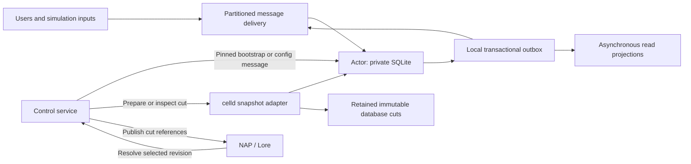

# NAP + celld: versioned agents and copy-on-write worlds

Design review and implementation scope — 2026-09-05.

**Recommendation:** keep all actor mutations in celld SQLite. Put immutable, retained database-cut references in Lore at explicit save points and branch boundaries. A control service provisions actors, captures cuts, and publishes revisions; actors never resolve NAP manifests or advance Lore HEAD. Branches share frozen state and receive independent mutable cells only when needed.

This supports versionable durable objects without a Lore commit after each database write. Native database snapshots are a suitable target. True page-level copy-on-write requires additional storage-engine work; it is not an existing celld capability established by this review.

This document is a proposed architecture, not an implemented integration. Source inspection covered NAP checkout `d1de2e3fe1b32ae6781f1c801c859b7d755da003` and public celld checkout `a52f9905425bc41134d817694bdc2c50bcc5e856`. The live celld documentation differs from that checkout in several API details. Qualify one pinned release before implementation; do not combine guarantees from different versions.

## 1. Direct answers to the brief

| Question | Answer |
| --- | --- |
| “Pointer-copying”: a pointer to what? | A new Lore branch refers to an existing revision. That revision resolves each actor to an immutable snapshot descriptor, which identifies retained database bytes or a complete retained base-and-log chain. It does not point to the source actor's changing database. |
| How is the correct database preserved? | Capture a consistent transaction cut, retain every required object, verify that the cut can be reconstructed, and then publish its descriptor in Lore. Later writes cannot change its meaning. |
| What is a timeline? | An independently evolving world execution associated with an immutable branch incarnation. The branch name is its editable label. Reuse Lore's existing branch UUID for the initial incarnation. |
| What is `ccc`? | An illustrative abbreviation for the snapshot's BLAKE3 content digest. A real value is `blake3:` followed by 64 hexadecimal characters. It is not a database name or special identifier. |
| Can celld databases themselves be versionable? | Yes, through a runtime-owned snapshot/fork contract. Lore can commit a small immutable descriptor while celld continues to mutate each branch's database independently. Sharing an S3 bucket alone does not supply that contract. |
| Must each database write become a Lore commit? | No. celld already handles live durability. Lore records selected historical cuts. Arbitrary intermediate states are restorable only if separately retained with enough information to reconstruct them. |
| Can actor code avoid all NAP queries? | Yes. A provisioning service resolves NAP and delivers a pinned initialization payload. Subsequent authored changes arrive as explicit configuration messages. Actors read their local applied configuration. |
| Can another service inspect a database without activating its actor? | There is existing internal celld machinery for this. It produces a private read-only SQLite copy, without claiming an inactive cell. It is an operator inspection path, not a public, bounded-latency, latest-state SQL API. |
| Does branching clone every database? | No. Branch from a retained save point by creating branch metadata only. A first activation may still copy the selected actor's state into a private local SQLite file. Page-level sharing after activation is a separate extension. |

## 2. What the current code actually establishes

### NAP and Lore

The checked-in Lore protocol already separates a branch's ID from its name. `BranchCreateRequest` accepts a caller-generated ID and concrete ancestry; `BranchDelete` tombstones by ID; names can be reused after deletion. This is the right identity mechanism to reuse, rather than adding another branch-name registry. See [revision.proto](../crates/nap-core/proto/lore/revision/v1/revision.proto) and [model.proto](../crates/nap-core/proto/lore/model/v1/model.proto).

The application-facing `VcsBackend::commit` accepts a working directory, message, and author. Its Lore implementation stages the working directory and invokes the CLI. It does **not expose** the brief's proposed `commitPatch(expected_parent, operation_id)` contract. The protocol includes CAS for branch **metadata**, but `BranchPushRequest` does not expose an expected-tip field. Metadata CAS must not be described as proven atomic revision publication. See [vcs.rs](../crates/nap-core/src/vcs.rs) and [vcs_lore.rs](../crates/nap-core/src/vcs_lore.rs).

NAP has content-addressed asset ingestion. The inspected implementation uses a hash plus format to locate bytes; `nap.objects.put(...)` in the brief is conceptual, not an existing API demonstrated here. Extend or wrap the existing storage abstraction with a runtime-object type and retention tracking. Do not invent another content store in Character code. See [storage.rs](../crates/nap-core/src/storage.rs).

### celld

The following are source findings, not proposed public APIs:

| Finding | Architectural consequence |
| --- | --- |
| `sqlite_snapshot` uses SQLite's backup API, including committed WAL data. | There is a useful internal primitive for producing an independent database image. Raw file copying is unnecessary. |
| `snapshot_active` makes a private copy of a selected local epoch. | Inspection can avoid executing the actor's application handler. |
| `restore_snapshot` restores the newest available replica without claiming or activating the cell. | Inactive database inspection is technically supported internally. |
| The control-plane explorer provides schema and bounded table previews. | This is not a general application query interface or historical snapshot service. |
| Fleet acknowledgments can precede bucket upload; takeover performs additional recovery. | A bucket-only inspection cannot automatically claim to include the latest acknowledged write. |
| Queues have one writer per queue. | One global message queue can become the next serialization bottleneck. |

Evidence: [SQLite backup implementation](https://github.com/denoland/celld/blob/a52f9905425bc41134d817694bdc2c50bcc5e856/crates/celld/replication.rs#L370), [snapshot inspection and restore](https://github.com/denoland/celld/blob/a52f9905425bc41134d817694bdc2c50bcc5e856/crates/celld/ltx_repl.rs#L2056), [control-plane explorer](https://github.com/denoland/celld/blob/a52f9905425bc41134d817694bdc2c50bcc5e856/crates/celld/control_plane.rs#L1173), [durability protocol](https://github.com/denoland/celld/blob/a52f9905425bc41134d817694bdc2c50bcc5e856/docs/guarantees.md), and [compatibility notes](https://github.com/denoland/celld/blob/a52f9905425bc41134d817694bdc2c50bcc5e856/docs/cloudflare-compat.md).

No supported public retained historical snapshot/fork API or page-level COW implementation was found in the inspected interfaces. In particular, do not infer Cloudflare point-in-time recovery or clone support from general Durable Object compatibility. The inspected `storage.sync()` implementation is not itself a fleet durability barrier; current website documentation describes stronger behavior. The integration must test the pinned runtime's actual durability boundary.

## 3. Reassessment of the five proposed models

| Proposal | Keep | Change or reject |
| --- | --- | --- |
| Model 1: cell state as representation | Existing content-addressed storage can hold snapshot bytes. | Use a distinct runtime descriptor; remove D1 routing; export only at selected cuts. A blob hash change is not a semantic database diff. |
| Model 2: D1 integration hub | An asynchronous query projection can support population visibility. | Reject a second authoritative entity/revision/world registry and synchronous dual writes. It adds another recovery problem and central bottleneck. |
| Model 3: shared storage fabric | Runtime durability can evolve independently of Lore. One bucket with isolated prefixes is feasible. Native retained database references are compatible with one Lore history. | Reject mutable `current` pointers as historical cut references and claims of automatic deduplication across keys. Runtime replication logs are not a competing VCS unless the integration gives them independent historical authority. |
| Model 4: manifest as schema constitution | Initialization may use authored seed data. | Keep migrations and schema definitions with the actor class. Manifest changes are not database migrations; reverting YAML cannot undo lost data. |
| Model 5 / 5A: manifest plus runtime cut | One selected Lore revision can identify authored data and retained actor cuts; the repository tree supplies the world index. | Move all NAP access and publication out of actors. Distinguish authored commits, live mutations, and synchronized saves. Add the missing cut-retention and atomic publication contracts. |

The revised recommendation keeps Model 5's historical structure and accommodates the requested native database references. Model 3's separation of runtime write rate from Lore publication rate is sound when it does not introduce another historical HEAD. Neither logical snapshots nor native snapshots require a VCS commit per database write.

## 4. The smallest coherent architecture



These are responsibilities, not a requirement for seven separate services. Stage 0 can use one control application, one queue consumer, one Character class, and the existing NAP and celld deployments. A transactional outbox is a table, not another database product.

| Owner | Authoritative responsibility |
| --- | --- |
| NAP / Lore | Entity identity, authored manifests, representations, named historical revisions, branch ancestry, references to retained runtime cuts. |
| Actor SQLite | Applied configuration, memory, goals, schedule, inbox, events, generation state, PRNG state, local outbox. |
| celld | Ownership, live database durability, replication, placement, alarms, and eventually retained database snapshot mechanics. |
| Control service | Provisioning, explicit configuration adoption, idempotent save/fork workflows, publication to Lore. |
| Read projection | Rebuildable discovery and scheduling hints with explicit freshness metadata. |

The normal mutation path does not read or write Lore. Existing initialized actors can continue during a Lore outage. Provisioning an uncached actor or creating a historical save point may wait for Lore; that does not put Lore in every actor transition.

“Actors write only their own database” still permits their runtime to replicate that database. It also permits a delivery service to send durable outbox entries. The authoritative application transition is local; transport delivery and snapshot publication occur outside it.

The prior rule against duplicating manifest content needs refinement: **a local applied-configuration projection is necessary** to satisfy zero manifest queries. It is a versioned input to the actor, not a competing authoring authority. Store its source revision/hash. Explicit messages replace it; actors never poll HEAD.

## 5. Identity and mutable branch names

Use existing immutable identifiers:

```text
repository_id = stable repository identity
branch_id     = Lore branch UUID
entity_id     = immutable NAP entity identity

cell_name = encodeTuple("nap-actor-v1", repository_id, branch_id, entity_id)
```

Use an unambiguous encoding, such as a canonical JSON array of strings or length-prefixed fields, rather than delimiter concatenation with unrestricted user input. Do not derive identity from the current revision, node, or branch label.

Resolve a human-readable branch name at the boundary where the user selects a world. Queue messages carry immutable IDs thereafter. A rename keeps the branch ID and cells. Deleting and recreating the same label produces a different branch ID and different cells. Old queued messages never re-resolve their label to the new branch.

Stage 0 restores into a **new Lore branch ID**. Directly resetting a branch ref does not rewind an already running cell. If the product later needs “rewind this same named world,” add a new runtime incarnation ID beneath the same branch ID, fence the old incarnation, and include the new incarnation in routing and message envelopes. Ordinary saves do not change that ID.

Branch deletion must stop new admission and fence old delivery/alarm work before reporting the runtime stopped. Cached routing permissions need an expiry/invalidation contract. Reusing a label is safe because identities differ; deleting a ref alone does not stop old processes.

## 6. What Lore must point to

Two references have different purposes:

```text
LiveActorRef  = (repository_id, branch_id, entity_id)
FrozenCutRef  = immutable descriptor digest
```

The live reference answers “which actor should receive this message?” The frozen reference answers “which exact database state should be restored?” A historical revision needs the latter.

An illustrative per-entity runtime descriptor:

```json
{
  "format": "nap-actor-runtime-v1",
  "entity_id": "nap://world/character/alice",
  "actor_class": "Character",
  "actor_schema": 1,
  "runtime_build": "sha256:<retained-code-digest>",
  "applied_config_hash": "blake3:<config-digest>",
  "cut": {
    "backend": "logical-cbor-v1",
    "object_hash": "blake3:<snapshot-digest>",
    "state_seq": "841"
  }
}
```

Fields containing angle brackets are placeholders. `state_seq` is an application revision counter for every restorable state mutation, including inbox and schedule changes; it is not celld's storage transaction ID. An event head can substitute only if every state mutation has a corresponding event. Use a decimal string in JSON to avoid 64-bit precision loss.

The native backend can replace the cut with a runtime-managed snapshot descriptor containing an immutable object root, storage format version, exact database transaction bound, application schema, and complete retained dependencies. Its identifiers must continue to resolve after the source cell moves, advances epochs, or is deleted. A bare `(source_cell, epoch, txid)` is insufficient without retention and an exact reconstruction contract.

Keep `entity.runtime.json` entries in the existing Lore repository tree. That tree already indexes actor cuts at a save point. Do not also maintain `world.runtime.json.entity_revisions`. A world runtime file is appropriate for actual world state—clock, seed, simulation policy—not a duplicate file index.

Several actors can publish their cut descriptors in one save revision. A separate persistent runtime map is justified only if measurements establish that writing those existing entries is inadequate. Even then, choose one authoritative index for cuts rather than maintaining both.

Authored revisions may advance while a running actor still uses an older configuration. Record that explicitly. An authored commit with an inherited runtime descriptor is not automatically a synchronized world save. A save operation either verifies matching applied configuration or declares the lag; it must not hydrate historical memory with whichever persona happens to be at current HEAD.

## 7. Copy-on-write: precise guarantees

Assume save revision `C42` points Alice to frozen snapshot `S42`.

```text
                              S42 (immutable)
                             /               \
                    branch A origin     branch B origin
                          |                    |
                    private DB A         not yet materialized
                          |
                     new local writes
```

Creating B copies no SQLite files and no snapshot objects. B shares S42. Later activity in A cannot change S42. B's first mutation initializes a new cell from S42, then writes to its own database. B never fetches A's latest state.

There are three different storage properties:

| Property | Recommended scope |
| --- | --- |
| Metadata-only branch creation from an existing cut | Required in the first implementation. |
| Shared immutable snapshots, lazy independent SQLite materialization | Required in the first implementation; COW at actor/object granularity. |
| Shared database pages with only changed pages allocated after activation | Optional native storage-engine extension; do not claim it exists today. |

Ordinary SQLite opening a downloaded/restored image gives each active branch a private database. This still avoids eager world copying, but a first activation costs roughly that actor's database size. A read-only inspection can avoid creating the destination actor; it may still reconstruct a temporary database.

Strict page COW requires a VFS or equivalent database layer mapping reads to an immutable page base plus a branch-local overlay, with coherent WAL, checksums, compaction, cache invalidation, and recovery. Copying a database to another S3 key is neither metadata-only cloning nor proof of page sharing. Sharding is partitioning data; replication is making copies. Neither operation alone establishes a fork boundary.

One physical bucket is viable with separate ownership prefixes and permissions. It does not make two references atomic or deduplicate distinct keys. Prefer one canonical retained object for each digest and a retention contract across NAP and the native runtime. Actor code never writes celld's reserved objects.

## 8. Initializing an actor without any actor-side NAP reads

The control service performs materialization planning:

1. Resolve the destination's immutable branch ID and select an exact revision once. On a new fork, this is its frozen origin, not the source branch's future HEAD.
2. Read the manifest/configuration and runtime descriptor against that selection. Verify their hashes and compatibility. An already checkpointed runtime restores its own recorded applied configuration.
3. Produce an authenticated bootstrap ticket binding the destination identity, source cut, configuration, codec/schema, and operation ID. Persist that selection before retryable delivery.
4. Fetch or stream verified snapshot data through the adapter. Send a privileged `Initialize` command; the actor itself has no NAP credentials or resolver dependency.
5. The actor accepts initialization only when uninitialized. For a small snapshot, import and set the initialized marker in one local transaction. For larger imports, stage chunks in its database, verify completeness, and atomically expose the imported state. Partial data cannot serve normal events.
6. Run the selected forward migration, restore logical schedule intent, and compute a fresh alarm. Keep initialization separate from LLM execution.
7. Acknowledge initialization durably, then process the triggering message using its original idempotency ID.

If two deliveries race to initialize, the same bootstrap operation is a no-op on retry. A different source-cut ticket for the same initialized destination is an explicit conflict. A cold activation of an already initialized actor only reopens its database; it does not fetch a new manifest.

If a bootstrap ticket is missing, return `NeedsInitialization`; the consumer invokes provisioning and retries. Do not silently initialize an empty actor or choose main. Bounded queue messages can carry a small bootstrap directly; large payloads use authenticated chunk delivery.

Subsequent authored edits use `ApplyConfiguration(expected_config_hash, new_config, source_revision, operation_id)`. That local transaction records the applied change and increments `state_seq`. Promotion of learned runtime state into authored properties remains an explicit control-service operation.

## 9. Saving a consistent cut without coupling actor writes to Lore

Use one idempotent workflow, with durable preparation in the actor and publication state in the control service. It is not a distributed SQL transaction.

```text
PREPARED -> OBJECT_RETAINED -> LORE_PUBLISHED -> ACKNOWLEDGED
```

For the logical backend:

1. In a synchronous local transaction, choose `state_seq = N`, export the allowlisted state, and store the exact snapshot bytes or durable frozen rows in `snapshot_jobs(operation_id, N, ...)`. Exclude this operational table from the exported state.
2. Return only through the qualified runtime's durable response boundary. Upload the frozen bytes through NAP storage from the control service. Live mutations after the transaction are allowed and do not alter the job's bytes.
3. Verify the uploaded object and establish retention before publishing its descriptor.
4. Publish one Lore revision with all selected descriptor patches, using an idempotent operation ID and an atomic expected-tip contract.
5. Tell each actor that sequence N was saved. Record `last_saved_seq = N`; current state is dirty when `state_seq > N`. Do not clear a boolean blindly.

Capturing the sequence in one transaction and scanning live tables later is incorrect. It can label state N+5 as state N. Snapshot bytes must survive process loss between preparation and upload; a transient JavaScript buffer alone is insufficient for retrying the same operation.

The native backend replaces logical export with a runtime-owned exact cut and durable retention receipt. All required state must be reconstructible independent of the serving node before Lore references it. A fleet durability proof for normal writes is not necessarily proof that an arbitrary snapshot reader can recover the same cut from the bucket.

For publication, add a narrow NAP service contract rather than having concurrent workers share one mutable CLI working directory. Suggested contract:

```text
publishRuntimeCut(branch_id, expected_revision, operation_id, file_patches)
```

The backend must make expected-tip validation and revision publication atomic, and deduplicate operation IDs with payload-hash validation. A preflight HEAD read followed by an unconditional commit does not suffice. This is an implementation gap to close and test, not an existing API to assume.

If unrelated files changed, reapply the patch on the new parent after validating all read dependencies, including applied configuration and world-cut constraints. If the same actor cut or required configuration changed, report conflict. A single publisher simplifies Stage 0 scheduling, but cannot replace server-side protection against other writers.

| Failure | Required recovery |
| --- | --- |
| Actor crashes during capture | Transaction rolls back, or the exact prepared job is retrievable. |
| Upload finishes but reply is lost | Retry by digest and verify existing content. |
| Lore rejects parent | Retain the prepared cut while reconciling; do not overwrite another actor's work. |
| Lore publishes but response is lost | Lookup by operation ID and adopt the existing revision. |
| Actor misses save acknowledgment | Retry the acknowledgment; subsequent mutations stay dirty. |
| Object retained but never published | Expire the preparation lease and collect after a grace period. |
| Source branch is deleted | Retained cuts used by historical refs or descendants remain readable. |

## 10. Branch an existing save versus fork the running world

`branchFromRevision(C42)` is cheap: create a fresh branch ID whose origin is C42. It makes no claim to include live changes after C42. Logical branch creation has no work proportional to database bytes; avoid promising constant latency for every Lore implementation detail.

`forkLive(source)` first captures state. For one persistent profile, pause that actor's state-changing work at a local boundary, retain its cut, publish the save, and create the new branch. Normal operation resumes on the source.

For a running multi-actor world, independently captured databases are not necessarily one causally consistent world. Alice's snapshot might include a received message while Bob's snapshot predates sending it. A timestamp label does not repair this.

The simplest exact-world protocol is a pause barrier:

1. Freeze input admission for the cut and establish a fixed participant roster. Buffer later external inputs outside the cut.
2. Gate **all** mutators: queue deliveries, internal messages, alarms, simulation ticks, configuration updates, and asynchronous generation/tool completions. Persist the gate so restart cannot bypass it.
3. Settle admitted work at defined boundaries. Capture undelivered messages as source outbox entries and delivered messages in destination inboxes. Include durable ingress state for accepted user inputs that have not reached an actor.
4. Snapshot the world clock and each changed participant. Reuse a previous cut only with authoritative proof it is unchanged. An eventually consistent dirty index is not enough; Stage 0 can enumerate the complete bounded roster.
5. Publish the complete descriptor set in one save revision; create the destination branch inactive; then resume source delivery.
6. Rebind inherited pending internal delivery to the destination branch when it runs. Reset transport acknowledgment metadata; use destination-scoped deduplication so a duplicate outbox/inbox record is applied once.

Queue acknowledgments must not discard the only copy of a message that the snapshot protocol needs. Retain application outbox records until durable inbox acknowledgment and safe checkpoint reclamation. An accepted external input similarly needs a durable admission record. The broker's opaque pending queue is not automatically snapshotted with actor databases.

If a required participant cannot freeze or export, abort the exact cut and resume from the durable gate state. Do not silently publish a partial world. Long-running model operations can remain pending in the cut, but late source completions must be fenced from the destination; the new branch must explicitly resume or abandon them.

Cost is at least proportional to changed participants plus retained data not yet covered by reusable cuts. Capturing arbitrary live changes across 100,000 independent databases cannot become a single free pointer update. Once the cut exists, multiple branches reuse it cheaply. A nonblocking distributed-snapshot protocol is a later optimization if pause time proves unacceptable.

## 11. Queue-driven actors and local-only writes

Every message carries repository ID, immutable branch/run identity, actor ID, application message ID, causation ID, and a schema version. Broker delivery IDs do not replace application IDs.

On delivery, one local transaction deduplicates the message, records the inbox event, applies permitted state changes, advances `state_seq`, and inserts outgoing effects in the outbox. Acknowledge the broker only after the actor's durable acknowledgment. Duplicate delivery returns the recorded result or pending operation status.

For strict local-only actor writes, a relay asks for a bounded outbox batch and sends it. The relay does not resolve manifests. The actor can arm an alarm for retry intent; alternatively, a durable sharded scheduler tracks relay work. A best-effort notification by itself cannot be the only way the relay discovers pending data.

Partition delivery by actor identity across several queues as throughput requires. Keep the partitioning scheme versioned when changing shard counts. One actor remains a serialization domain; many actors can run independently. No global total message ordering is implied.

For LLM work, persist an operation before dispatch, use an external generation worker, and return the result as another message. This lets the actor release residency while the model runs. Accept a result only if its operation ID, run identity, and state/configuration preconditions still match. Persist completed output once or in coarse chunks. Token previews can be streamed through a gateway but are not historical truth until accepted durably. Provider calls can still be charged twice after ambiguous failures; application idempotency cannot undo external effects.

The inspected celld queue implementation has fixed four-day message retention and lacks pull consumers. Therefore long dormancy must store work in durable application inbox/schedule state, not leave it waiting indefinitely in the broker. Verify queue capacity and backpressure against the selected release; live documentation and the inspected checkout differ in producer concurrency limits.

## 12. Querying schedules and goals without activation

Expose consistency explicitly rather than one ambiguous `queryActor()` call:

| Mode | Meaning | Execution and cost |
| --- | --- | --- |
| `atCut(snapshot_ref)` | Exact immutable historical state. | Read a retained image in a separate read-only query worker; no actor activation. Cache by digest. |
| `projected(max_age)` | Last projected actor state, with sequence and observation time. | Cheap indexed query; no actor activation. Can be stale. |
| `replica` | Available replicated state, with its lineage and observed application sequence. | celld inspection foundation; may download/reconstruct a database and may lag. |
| `authoritative` | Current state serialized through the actor. | May activate the actor, but never automatically calls an LLM. |

The existing explorer proves feasibility of replica inspection. A product API still needs bounded selected columns/predicates, authorization, concurrency isolation for temporary files, and freshness metadata. Its present response's epoch/source label is not a sufficient freshness watermark. Do not poll reconstructed databases across 100,000 NPCs to discover their next wake time.

Use a small asynchronous projection for queries such as `next_due`, `lod`, `location`, and goal summaries. Updates carry `(branch/run, actor, state_seq)` so stale deliveries cannot overwrite newer rows. Deletions require tombstones. It is acceptable derived duplication because actor state remains authoritative and the projection is rebuildable.

Scheduling has a stronger requirement than dashboard display. Either keep the actor's durable alarm as the wake authority or use a reliable sharded scheduler fed by a transactional outbox with repair/reconciliation. If the scheduler becomes the only wake mechanism, its index is correctness-critical infrastructure, not an optional best-effort cache. Schedule edits must invalidate old work, and the actor must recheck due/version state before executing a wake.

## 13. Cognitive level of detail

Actor existence, residency, and cognition are separate dimensions. A persistent database does not require a resident process, and a brief activation does not require reasoning.

| Level | Behavior | Activation policy |
| --- | --- | --- |
| Dormant | Preserve state; derive simple time-dependent values; track next meaningful event. | No periodic per-actor ticking. Remain inactive until actual work is due. |
| Simulated | Deterministic rules or state machine; bounded time catch-up. | Short activation for a meaningful transition, then evict. |
| Reactive | Cheap policy and, where justified, a small model. | Event-triggered local transition; asynchronous model work when needed. |
| Deliberative | Planning, richer memory retrieval, full LLM and tools. | Explicit budgeted operation with persisted inputs and result validation. |

The requested distribution—92,000 dormant, 6,500 simulated, 1,300 reactive, 200 deliberative out of 100,000 entities—is a target population mix, not a capacity or cost measurement. Resident-cell count depends on arrival rate and activation duration. A dormant population is near-zero compute only when it avoids recurring scans, per-actor ticks, and persistent connections; storage and occasional I/O still cost resources.

Store `lod`, policy version, `last_simulated_world_time`, PRNG state, and next logical due time. Derive world time from a versioned clock anchor and rate; a pause or rate change invalidates scheduling calculations. Large populations may require scheduler-mediated rearming rather than waking every actor on every clock update.

Use analytic catch-up only for rules where skipping intermediate steps preserves semantics. Hunger decay may be computable from elapsed time; a missed meeting that should send messages is not automatically safe to skip. Bound work and emit intermediate consequential events when needed. Persist authoritative transitions inside the actor's own database.

Promotion can follow player proximity, a direct question, conflict, or important goals. Add hysteresis and minimum dwell times to avoid repeated promotions/demotions. Apply global and per-world model concurrency and token budgets in the generation dispatcher. Snapshot import, constructor execution, schedule inspection, and a configuration refresh never implicitly promote an actor to deliberative mode.

## 14. Snapshot format and schema contract

Start with one versioned, deterministic logical codec for the proof of concept. Canonical CBOR is reasonable, but only with an explicit profile and golden vectors. It is an interoperability format, not a guarantee that native SQLite images of equivalent data hash identically.

Required rules:

- Export only declared application tables and columns. Require stable primary keys and define byte-stable row ordering independent of locale or SQLite text collation.
- Specify deterministic CBOR encoding, duplicate-map-key rejection, integer representation, typed BLOB bytes, UTF-8 text, NULL, and floating-point handling. A simple v1 can disallow non-finite reals and normalize negative zero where the schema treats it as zero.
- Protect 64-bit integers before JavaScript rounds them. Either constrain Stage 0 fields to safe integers or use a verified lossless extraction path; CBOR cannot repair a number already rounded by the SQL-to-JavaScript bridge.
- Include all authoritative runtime state: applied config, memory, goals, schedules, inbox, pending application outbox, deduplication state, operation state, logical clock/PRNG data, and the application state sequence.
- Exclude deployment credentials, node/cell placement, ownership epochs, branch routing context, local file paths, snapshot-publication jobs, replica metadata, and transport retry acknowledgments. Preserve domain facts about past messages without treating old delivery coordinates as future routing instructions.
- Keep creation timestamps and source-branch provenance in the descriptor/envelope if they do not define domain state. Do not inject the destination branch ID into shared snapshot bytes.
- Reject partial/truncated snapshots, unknown required fields/codecs, incompatible schema, and digest mismatches. Verify every dependency before marking a destination ready.

Avoid full event sourcing in Stage 0. Full logical snapshots restore state directly. If event segments later substitute for snapshots, replay must cover every relevant mutation with versioned deterministic reducers and stored model/tool outputs. A partial audit log is not a recovery log.

Migration code belongs to the Character implementation. Migrate a new working database forward without rewriting the historical object. Record that the working state migrated and needs a new save if historical representation changes. Exact code replay also needs retained compatible code: recording a digest does not make the current fleet run that digest. The inspected celld deployment model uses the fleet's deployed application. Initially support compatible forward migrations; isolated historical-code execution is separate scope.

For native SQLite cuts, distinguish byte identity from semantic identity. SQLite file layout, freelists, and runtime metadata can differ for equivalent logical rows. Hashing the image reliably identifies those exact bytes; logical export remains useful for semantic diff, portability, and upgrade escape hatches.

## 15. Native versionable cells: focused extension

The target extension belongs behind a celld-owned adapter. These names are proposed contracts:

```text
freezeCell(cell_ref, operation_id) -> retained_cut_ref
forkCell(retained_cut_ref, destination_identity, operation_id) -> lazy_origin
inspectCut(retained_cut_ref, bounded_query) -> rows + cut_metadata
retainCut(retained_cut_ref, root_id)
releaseCut(retained_cut_ref, root_id)
```

`freezeCell` must select an exact committed database cut, associate it with application state/schema metadata, and retain a reconstructible image or complete immutable chain. Repeating the operation returns the same cut, not a later database. It must not return success while essential state exists only on an unpinned node log.

`forkCell` must not open or clone every actor at world branch creation. It records an immutable bootstrap origin. On first materialization it establishes a new cell identity and fresh ownership/replication lineage. It must rebuild or scrub reserved runtime metadata, bind domain messages to the new branch, and reconstruct alarm intent rather than inherit the source's wake records. This requires runtime support; an application cannot safely install a physical image by copying reserved bucket prefixes.

Start native support with retained standalone database cuts and lazy local restore. Reusing LTX chains can avoid image exports later, but increases obligations: immutable bounds, format compatibility, transitive retention, compaction preservation, and restore independent of source ownership. Sharing physical pages after activation is another step and requires its own isolation/recovery test suite.

GC roots include historical revisions, tags/branches retained by policy, active branch origins, pending publications, and live restore leases. Removing one source branch must not reclaim a base used by another. Content hashes identify bytes; they neither authorize access nor prevent collection. If NAP references runtime-owned retained objects, NAP publication and runtime retention must be coordinated with an idempotent protocol.

## 16. Implementation sequence and acceptance gates

| Stage | Deliverables | Exit gate |
| --- | --- | --- |
| 0: One persistent profile | Character schema; local inbox/outbox; queue consumer; external provisioning; deterministic logical snapshots; explicit save and branch operations; Lore publication contract. | Restart preserves state; duplicate delivery is harmless; branch starts from its exact cut; actor never queries NAP or commits Lore. |
| 1: Useful population simulation | Cognitive LOD policy; bounded catch-up; reliable wake handling; read projections; partitioned queues; model dispatcher. | Dormant actors cause no periodic activation; model work respects budgets; index lag does not lose wakes. |
| 2: Native database versioning | Retained SQLite cuts; lazy fork/import; read-only cut query; source-independent retention and migration compatibility. | Source deletion, compaction, ownership changes, and process failure cannot break a retained fork. |
| 3: Exact world cuts | Durable admission/mutation barrier, complete participant accounting, channel-state handling, batched Lore publication. | Cross-actor messages are neither lost nor applied twice across a world fork; incomplete cuts fail explicitly. |
| 4: Measured storage optimization | Page/chunk COW or retained-LTX sharing, only if first-activation copying dominates cost. | Write amplification, restore latency, and isolation are demonstrated under fault injection. |

If page-level COW is a launch requirement, move its storage-engine work onto the critical path. Do not call the logical snapshot PoC completion of that requirement. If world branching from retained cuts is sufficient, Stage 0 already validates the core versioned-agent model with considerably less runtime risk.

Suggested code boundaries: `ActorState` for local schema/transitions, `SnapshotCodec` for deterministic export/import, `SnapshotBackend` for logical/native cut handling, `ActorControl` for provisioning/save/fork workflows, and a narrow NAP publication adapter. Keep these as modules initially. Avoid a generic schema-in-manifest framework, a duplicated world revision database, or a new distributed transaction protocol.

Required integration acceptance scenarios:

1. Save Alice at N; mutate main to N+20; first activate the experiment and observe N, with no later memories or configuration leakage.
2. Create a branch without creating destination Character databases; modifying one destination actor leaves all source state and retained base objects unchanged.
3. Rename and delete/recreate a branch label; old messages cannot reach the new branch's actors.
4. Interrupt every snapshot/publication transition, including lost success replies; retries converge to one cut and one logical publication.
5. Deliver duplicate messages and generation results after restore; reject stale-run results and apply valid messages once.
6. Capture while an inbox, schedule, or goal update races; restored state and `state_seq` belong to one exact transaction cut.
7. Inspect an inactive actor and prove no constructor, alarm, ownership claim, or LLM runs; expose replica lag rather than claiming current state.
8. Exercise dropped/reordered projection updates and scheduler restarts; due work remains recoverable.
9. Round-trip BLOBs, NULL, Unicode, numeric boundaries, and supported schema migrations with deterministic codec vectors.
10. Fork from a cut, remove its source, compact live replicas, and restart all nodes; the destination remains reconstructible.
11. Reject a racing Lore publication without losing another actor's descriptor; retry unrelated patches safely.
12. Test an exact world cut with messages in flight and paused model completions; preserve channel state and fence source-only effects.

This review validates the architecture against source interfaces. It does not establish load capacity, crash safety of the proposed extensions, or implementation completion. Those are the purpose of the acceptance gates above.
